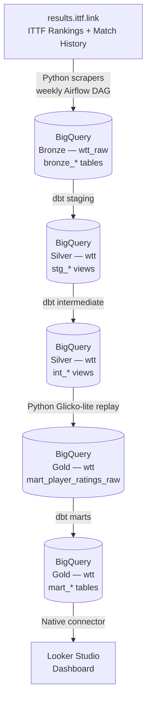

# WTT Analytics Pipeline

A production-style ELT pipeline that scrapes World Table Tennis (WTT) and ITTF match data,
applies a Glicko-lite rating engine, and surfaces an over/underranked analysis in Looker Studio.

## What it does

The ITTF publishes weekly world rankings, but rankings are primarily based on tournament
points rather than head-to-head match outcomes. This pipeline computes an independent
model-based rating (Glicko-lite) for every ranked player and compares it to their official
ITTF rank — surfacing players the model considers overranked or underranked.

## Tech Stack

| Component | Technology |
|---|---|
| Orchestration | Apache Airflow 2.9 (Docker Compose, LocalExecutor) |
| Ingestion | Python 3.11 (requests, BeautifulSoup, tenacity) |
| Data Warehouse | Google BigQuery |
| Transformation | dbt Core 1.8 + dbt-bigquery |
| Rating Engine | Python — Glicko-lite, ported from [RallyBase](https://github.com/ttrc-rally) |
| Visualization | Looker Studio |

## Architecture



### Medallion layers

| Layer | Prefix | Dataset | Materialization |
|---|---|---|---|
| Bronze | `bronze_` | `wtt_raw` | Tables (append-only) |
| Silver — Staging | `stg_` | `wtt` | Views |
| Silver — Intermediate | `int_` | `wtt` | Views |
| Gold — Marts | `mart_` | `wtt` | Tables |

### Airflow DAGs

| DAG | Schedule | Description |
|---|---|---|
| `wtt_ingest` | Every Monday 06:00 UTC | Scrapes rankings, match history, ranking history → Bronze; triggers `wtt_transform` |
| `wtt_transform` | Triggered only | dbt staging → intermediate → Glicko replay → dbt marts |

### Key design decisions

**Player-centric ingestion** — data is scraped per-player using the ITTF ranking table as the seed list, not per-tournament. Each player ID maps to three endpoints: rankings, match history, and ranking history.

**Watermark-based incremental loads** — each weekly run checks the max year already loaded per player and only fetches the current year's new records. Full-history scrapes run only on first load.

**Rating engine outside dbt** — Glicko-lite replay is a stateful, chronologically-ordered computation that cannot be expressed in SQL. It runs as a Python Airflow task between the intermediate and mart layers, writing `mart_player_ratings_raw` which dbt then reads.

**Glicko-lite v1 parameters are locked** — validated on 359,724 USATT matches (Brier score 0.176 vs 0.191 baseline). Do not change without re-validation. See `rating_engine/glicko.py` for constants.

## Setup

Prerequisites: Python 3.11+, Docker Desktop, Git, a Google Cloud account.

Full instructions are in [SETUP.md](SETUP.md). The condensed path:

```bash
# 1. Clone and create venv
git clone <repo-url>
cd wtt_analytics_pipeline
python -m venv .venv
source .venv/bin/activate        # Windows: .venv\Scripts\activate
pip install -r requirements.txt

# 2. Configure credentials
cp .env.example .env
# Edit .env: set GCP_PROJECT_ID, GCP_KEYFILE_PATH, ITTF_USERNAME, ITTF_PASSWORD

# 3. Verify BigQuery connection
cd dbt
dbt debug --profiles-dir .       # should print "All checks passed!"
cd ..

# 4. Start Airflow
cd airflow
docker compose up airflow-init   # first-time only — initialises DB and creates admin user
docker compose up -d             # starts webserver + scheduler; UI at http://localhost:8080
```

GCP setup (creating the project, BigQuery datasets, and service account key) is covered in [SETUP.md §2](SETUP.md#2-gcp-project--bigquery-setup).

## Running the pipeline

Once Airflow is running, trigger a full pipeline run from the UI or CLI:

```bash
# Trigger ingest (which auto-triggers transform on completion)
docker exec airflow-airflow-scheduler-1 airflow dags trigger wtt_ingest

# Or trigger transform only (requires Bronze data already in BQ)
docker exec airflow-airflow-scheduler-1 airflow dags trigger wtt_transform
```

Alternatively, unpause `wtt_ingest` in the Airflow UI and it will run automatically each Monday at 06:00 UTC.

**Expected run times** (first full load, ~2,200 players):
- `scrape_rankings`: ~2 min
- `scrape_match_history`: 1–3 hours (rate-limited to 1.5 s/player)
- `scrape_ranking_history`: 1–3 hours
- `wtt_transform` (dbt + replay): ~10 min

Incremental weekly runs are significantly faster (~30 min total) since only the current year's matches are fetched.

## Repository structure

```
wtt_analytics_pipeline/
├── ingestion/              # Python scrapers → Bronze
│   ├── scrape_rankings.py
│   ├── scrape_match_history.py
│   ├── scrape_ranking_history.py
│   └── bq_loader.py
├── rating_engine/          # Glicko-lite → mart_player_ratings_raw
│   ├── glicko.py
│   └── replay.py
├── dbt/
│   └── models/
│       ├── staging/        # stg_matches, stg_rankings, stg_ranking_history
│       ├── intermediate/   # int_player_match_history
│       └── marts/          # mart_player_ratings, mart_rating_vs_ranking
├── airflow/
│   └── dags/
│       ├── wtt_ingest_dag.py
│       └── wtt_transform_dag.py
└── docs/
    ├── architecture.md
    └── session-logs/
```

## v2 Roadmap

| Feature | Description |
|---|---|
| Score modifier validation | Enable the game-score modifier (disabled in v1) and measure Brier improvement on WTT data |
| Parameter retuning | Re-sweep `base_k` and `inactivity_rd_growth_c` for the elite player distribution |
| Time-series mart | `mart_player_timeseries`: weekly rating + RD + ITTF rank per player |
| Match prediction engine | `mart_match_predictions`: head-to-head win probabilities for upcoming WTT events |
| Looker Studio pages 3–4 | Player Profile (rating trajectory) and Match Predictions pages |
| Full Glicko-2 upgrade | Full sigma update rules if prediction improves on WTT validation set |
