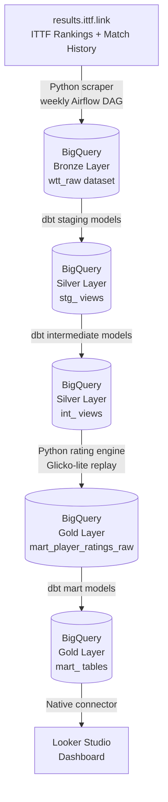

# WTT Analytics Pipeline — Architecture

## Overview

A production-style ELT pipeline ingesting World Table Tennis (WTT) and ITTF
match results into BigQuery, transforming them through a Medallion architecture
using dbt Core, and surfacing findings in a Looker Studio dashboard.

## Architecture Diagram

## Layer Definitions

| Layer | dbt prefix | BigQuery dataset | Materialization |
|---|---|---|---|
| Bronze | `bronze_` | `wtt_raw` | Tables (raw, append-only) |
| Silver - Staging | `stg_` | `wtt` | Views |
| Silver - Intermediate | `int_` | `wtt` | Views |
| Gold - Marts | `mart_` | `wtt` | Tables |

## Key Design Decisions

### Watermark-based incremental ingestion
Rather than full reloads, each weekly run checks the latest `match_date`
already loaded per `player_id` and only fetches newer matches. This keeps
Airflow run times under 10 minutes for weekly refreshes.

### Player-centric ingestion pattern
Data is scraped per-player rather than per-tournament. The ITTF ranking table
provides the seed list of all active player IDs. Each ID maps deterministically
to profile, match history, and ranking history endpoints.

### Rating engine outside dbt
The Glicko-lite rating replay is a stateful, ordered computation — not a SQL
transformation. It runs as a Python Airflow task between the intermediate and
mart dbt layers, writing its output to BigQuery as a raw table that mart models
then read from.

### Score modifier disabled in v1
Per RallyBase v1 release spec: the game-score modifier was disabled due to
data quality concerns in USATT data. WTT match data includes individual game
scores (e.g. 11:7, 9:11, 11:3) which are cleaner — enabling and validating
the score modifier on WTT data is a planned v2 experiment.

## v2 Roadmap

See SETUP.md Section 9.
